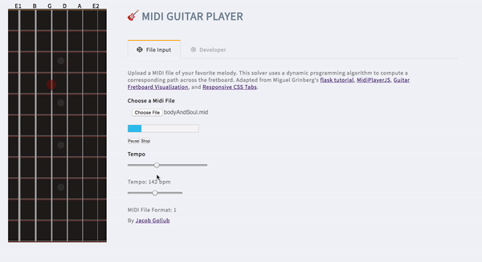
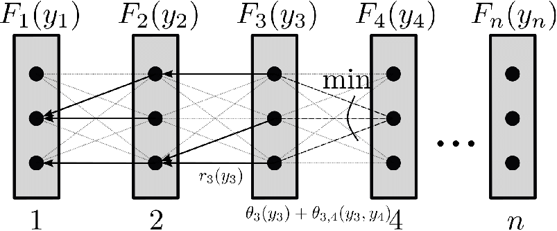

Welcome to Midi Guitar Player!

Currently supports monophonic midi files. Input a desired melody and the solver will generate a fretboard path via a dynamic programming algorithm.

For any two adjacent notes, consider playing the first with each of four fingers (index through pinky). Then, from each note/finger combination, consider playing the next note with each of the same four fingers. By considering the minimum cost path to each prior note/finger and transition costs to the following note/finger, we determine the minimum cost path to all note/finger combinations for the following note. Using this recursively, generates an optimal fretboard path for the selected melody.

To get started from the command line,

$ git clone https://github.com/jgollub1/guitar_dp.git
$ cd guitar_dp
$ python3 -m venv venv
$ source venv/bin/activate
$ pip3 install -r requirements
$ flask run

Feel free to edit the cost function, either in guitar_util.py or in the codeMirror through app -> developer. For more sample midi files of solo transcriptions, see https://jazzomat.hfm-weimar.de/dbformat/synopsis/solo410.html

You can reach me at jacobgollub@gmail.com
